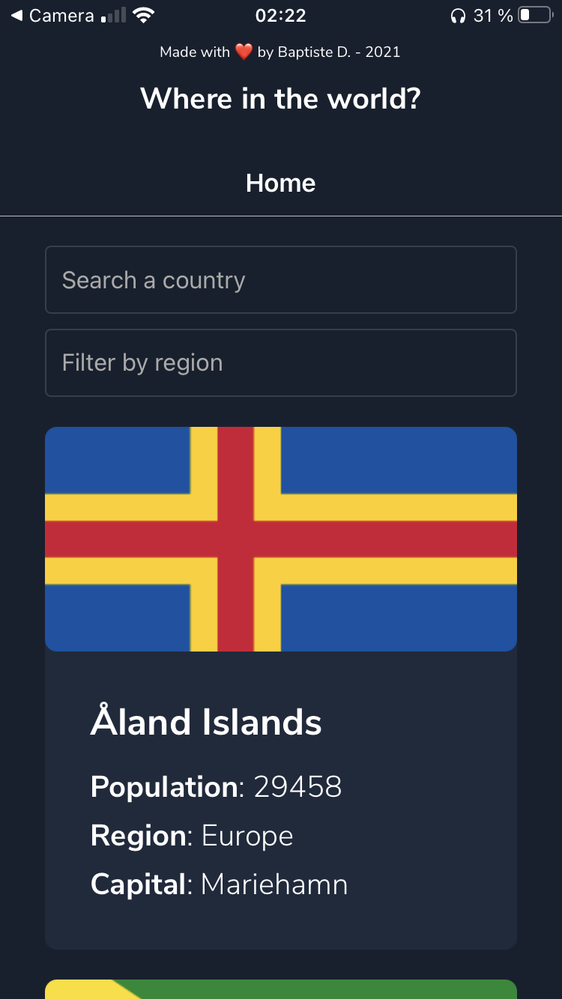

<div align="center">
  
  
  
</div>
<br>
<div align="center">
  <h3>React Native Countries App</h3>
  
  
</div>

---

React Native Countries App is a mobile application where you can search and filter all the countries in the world.

It uses the [Rest Countries API](https://restcountries.com) to get a lot of data about the different countries, like the population, the flag, the border countries and many others.

### Use

1. Install the dependencies.

```sh
npm i
```

2. Start the expo app.

```sh
npm start
```

3. Scan the QR Code with your mobile or start a Simulator.

4. If you don't have Expo Go on your smartphone, download it.

And voilà !

### Team

- Baptiste DAUPHOUY ([@baptistedph](https://github.com/arthur-fontaine))
